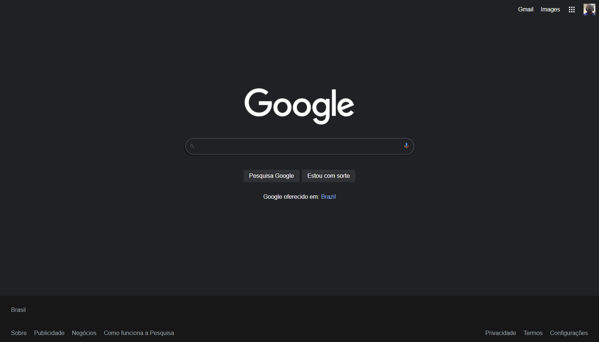

# Página Inicial do Google
Projeto realizado com o auxílio de uma aula disponibilizada no Youtube.

### Preview do Projeto

[Clique aqui para acessar](https://marqueba.github.io/google-homepage/)

## Tecnologias Utilizadas
- ``HTML``
- ``CSS``

## Contato

| [ Marcos Reis Dutra](https://github.com/Marqueba)